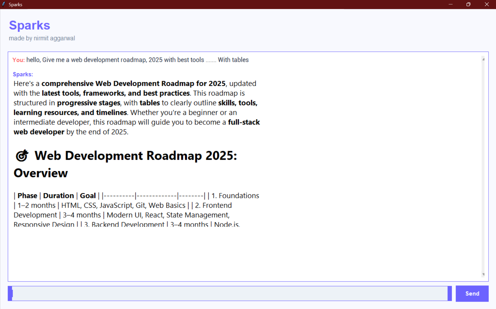

# Sparks Chat Application

A modern, beautiful chat application built with Python and Tkinter, powered by LongCat AI.



## Created by

Nirmit Aggarwal

## Features

- Modern and colorful UI
- Markdown support in messages
- Real-time chat with AI
- Message logging
- Custom fonts and styling
- Responsive design

## Requirements

- Python 3.8 or higher
- Required Python packages:
  ```
  tkinter
  tkhtmlview
  requests
  markdown
  ```

## Installation

1. Clone this repository
2. Install the required packages:

   ```bash
   pip install tkhtmlview requests markdown
   ```

   Note: tkinter usually comes pre-installed with Python.

3. Download and place the required fonts in the project directory:

   - Create a `fonts` directory
   - Download and place the following fonts:
     - Poppins (for headers and UI elements)
     - Roboto (for chat messages)

4. Get your API key:
   - Visit [LongCat Platform](https://longcat.chat/platform/usage)
   - Sign up/Login to get your API key
   - Replace the `API_KEY` in `index.py` with your key

## Usage

1. Run the application:
   ```bash
   python index.py
   ```
2. Start chatting with the AI by typing your message and pressing Enter or clicking Send

## Documentation

For more information about the LongCat API:

- [API Documentation](https://longcat.chat/platform/docs/)
- [Platform Usage Guide](https://longcat.chat/platform/usage)

## Note

Make sure to keep your API key secret and never commit it to version control.
